# CPU Rasterizer

一个使用 C++20 与 Win32 API 从零实现的纯 CPU 软件光栅化渲染器。项目不依赖 Direct3D、OpenGL 或 Vulkan，而是在 CPU 侧完整复现现代渲染管线中的核心环节：帧缓冲、顶点变换、视锥裁剪、三角形光栅化、深度测试、透视校正插值、纹理采样、法线贴图、多光源着色与阴影映射。

**项目价值摘要**

- 从零实现 CPU Rasterizer，用可运行程序展示 GPU 渲染管线的底层机制，而不是调用现成图形 API。
- 支持 OBJ 模型加载、JPEG/PNG 纹理、Normal Mapping、多光源 Blinn-Phong 着色和 CPU Shadow Mapping。
- 提供 Albedo、Normal、Depth、UV、Shadow Factor、Light、Light-space Depth 等 Debug Views，用中间结果验证渲染正确性。
- 内置性能 HUD，展示 FPS、帧耗时、Shadow/Main Pass 耗时、三角形数量和像素统计，便于观察 CPU 渲染瓶颈。

## 项目预览

### 最终渲染

最终画面展示 OBJ 模型加载、材质纹理、法线贴图、多光源光照、Blinn-Phong 高光、阴影映射与帧缓冲输出。


### 调试视图

调试视图用于拆解渲染结果，分别验证纹理采样、法线方向、深度分布、UV 坐标、阴影因子、光照响应和光源空间深度。

| Albedo | Normal |
| --- | --- |
|  |  |
| Depth | UV |
|  |  |
| Shadow Factor | Light |
|  |  |
| Light-space Depth |  |
|  |  |

### 性能 HUD

HUD 展示 FPS、Frame、Update、Render、Shadow/Main Pass、Present、输入与光栅化三角形数量、着色像素和 Shadow Map 写入次数，方便定位瓶颈来自主渲染、阴影生成还是窗口提交。


## 项目亮点

- **纯 CPU 渲染管线**：顶点处理、视锥裁剪、三角形光栅化、深度测试和像素着色全部在 CPU 侧完成，不依赖图形 API。
- **完整光栅化核心**：实现齐次裁剪、背面剔除、屏幕空间包围盒扫描、重心坐标插值和逐像素深度缓冲。
- **透视正确的材质渲染**：基于 `1/w` 对 UV、法线、切线、世界坐标和观察空间坐标做透视校正，支持纹理采样与 Normal Mapping。
- **光照与阴影**：实现环境光、方向光、点光源、Lambert 漫反射、Blinn-Phong 高光，以及带 bias 和 3x3 加权 PCF 的 CPU Shadow Mapping。
- **资源与工程支持**：支持 Wavefront OBJ 的位置、UV、法线、负索引和多边形三角化，并通过 Windows Imaging Component 加载 JPEG/PNG 纹理。
- **可验证与可观测**：通过多种 Debug Views 和性能 HUD 拆解中间结果，方便验证 UV、法线、深度、阴影和性能瓶颈。

## 技术难点与解决

- **齐次裁剪与三角形光栅化**：在裁剪空间处理视锥边界，避免近裁剪面后的异常三角形，再通过屏幕空间包围盒与重心坐标逐像素填充。
- **透视校正插值**：对 UV、法线、切线和空间坐标使用 `1/w` 校正，避免纹理和光照在透视投影下出现线性插值失真。
- **切线空间与 Normal Mapping**：根据模型顶点和 UV 自动构建切线方向，在像素阶段采样 normal map，并将扰动后的法线带入光照计算。
- **CPU Shadow Mapping**：从主方向光视角生成深度图，在主渲染阶段结合 constant bias、slope-scale bias 和 3x3 PCF 计算软阴影，降低阴影痤疮和硬边问题。
- **调试与性能观测**：将最终画面拆成 Albedo、Normal、Depth、UV、Shadow Factor、Light 和 Light-space Depth 等中间视图，并用 HUD 统计各阶段耗时和像素写入规模。

## 技术栈

- 语言：C++20
- 构建：CMake
- 平台：Windows / Win32 API
- 图像解码：Windows Imaging Component
- 核心方向：CPU Rasterization、Software Rendering、Real-time Rendering Fundamentals

## 项目结构

```text
.
├── CMakeLists.txt
├── README.md
├── docs/images/          # README 展示截图
├── res/
│   ├── Model/            # OBJ 模型资源
│   └── Texture/          # diffuse / normal 纹理资源
└── src/
    ├── core/             # Application、Camera、Framebuffer
    ├── math/             # 向量、矩阵和基础数学函数
    ├── platform/         # Win32 窗口、输入和帧缓冲提交
    ├── renderer/         # 光栅化、材质、纹理、OBJ 加载
    └── scenes/           # 默认测试场景和 Draw Command 组织
```

## 管线流程图

```mermaid
flowchart LR
    A["场景与 Draw Command"] --> B["顶点变换 MVP"]
    B --> C["视锥裁剪"]
    C --> D["透视除法与视口映射"]
    D --> E["背面剔除与包围盒扫描"]
    E --> F["重心坐标光栅化"]
    F --> G["透视校正插值"]
    G --> H["深度测试"]
    H --> I["纹理 / Normal Map / 光照"]
    I --> J["Shadow Mapping 与 PCF"]
    J --> K["写入帧缓冲"]
    K --> L["Win32 窗口显示"]
```



## 功能展示

| 模式 | 按键 | 说明 |
| --- | --- | --- |
| Final | `1` | 最终渲染结果，包含材质、纹理、多光源、Blinn-Phong 高光与阴影 |
| Albedo | `2` | 展示纹理采样、顶点颜色与材质 diffuse 共同得到的基础颜色 |
| Normal | `3` | 将观察空间法线映射到 RGB，用于检查法线与 normal map |
| Depth | `4` | 展示当前相机视角下的 NDC 深度 |
| UV | `5` | 将 UV 坐标映射为颜色，用于检查纹理坐标 |
| Shadow Factor | `6` | 展示 bias 和 PCF 后的阴影因子 |
| Light | `7` | 使用白色表面展示纯光照响应 |
| Light-space Depth | `8` | 展示像素投影到主方向光空间后的深度 |

## 性能指标 HUD

程序默认在左上角显示性能 HUD，可用 `F2` 开关。HUD 会展示 FPS、总帧耗时、Update / Render / Present 耗时、Shadow Pass / Main Pass 耗时、输入与光栅化三角形数量、着色像素、通过深度测试写入的像素，以及 Shadow Map 深度写入次数。

耗时条形图以当前帧耗时或 Render 阶段耗时为参考，适合快速判断瓶颈来自主渲染、阴影生成、窗口提交还是场景更新。

## 场景与资源

默认场景会加载以下资源：

- `res/Texture/Frosted Metal Texture.jpeg`
- `res/Texture/Cobblestone_pavement_texture.jpeg`
- `res/Texture/Cobblestone_pavement_normal_texture.png`
- `res/Model/Linnea.obj`

OBJ 模型可以放在：

- `res/Model`
- `res/Models`

加载器会读取找到的第一个 `.obj` 文件，并将模型归一化到适合当前场景的尺寸。如果没有可用 OBJ，程序会回退到内置球体与立方体场景。

## 操作说明

| 输入 | 功能 |
| --- | --- |
| `W` / `S` | 前进 / 后退 |
| `A` / `D` | 左移 / 右移 |
| `Q` / `E` | 下移 / 上移 |
| `Space` | 上移 |
| `Shift` | 加速移动 |
| 方向键 | 旋转视角 |
| 鼠标右键拖拽 | 旋转视角 |
| `F11` / `Alt+Enter` | 切换全屏 |
| `F2` | 显示 / 隐藏性能 HUD |
| `1` 到 `8` | 切换 Render Mode / Debug View |

## 构建与运行

```powershell
cmake -S . -B build
cmake --build build --config Release
.\build\Release\CPURasterizer.exe
```

Debug 版本也可以运行，但复杂模型、视锥裁剪、Shadow Mapping 和 PCF 阴影采样都在 CPU 上完成，查看完整场景时建议优先使用 Release 构建。

```powershell
cmake --build build --config Debug
.\build\Debug\CPURasterizer.exe
```

## 后续规划

- 接入 ImGui 调试面板，支持实时调整渲染模式、光源参数、阴影 bias 与 PCF 设置。
- 继续扩展性能统计与对比方式，用于分析 CPU 渲染瓶颈和验证后续优化效果。
- 优化光栅化阶段性能，包括背面剔除、包围盒扫描、Shadow Map 分辨率控制和 PCF 采样开关。
- 完善材质与色彩处理，加入 Gamma Correction、Tone Mapping，并尝试实现简化 PBR 材质模型。
- 探索 Tile-based Rasterization 与多线程渲染，提高复杂模型和高分辨率场景下的渲染性能。

## 项目边界

当前版本聚焦于学习和展示 CPU 光栅化管线，因此没有接入 GPU 图形 API，也没有做大型引擎架构封装。
