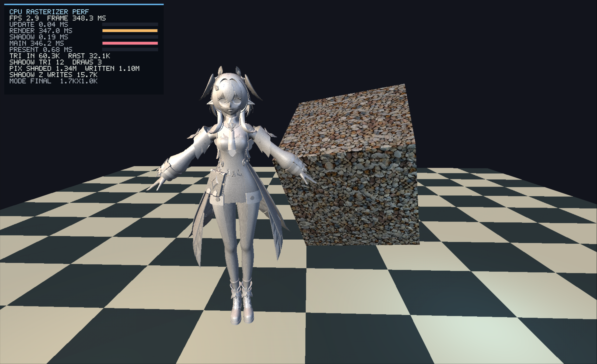
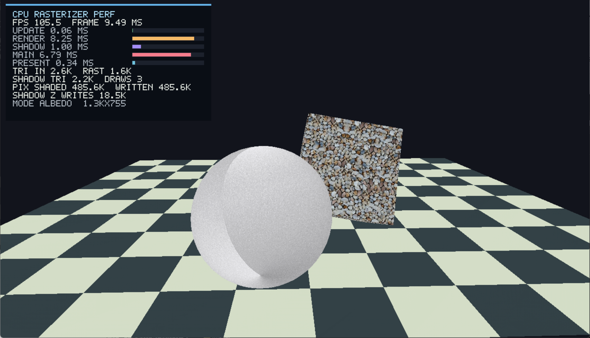
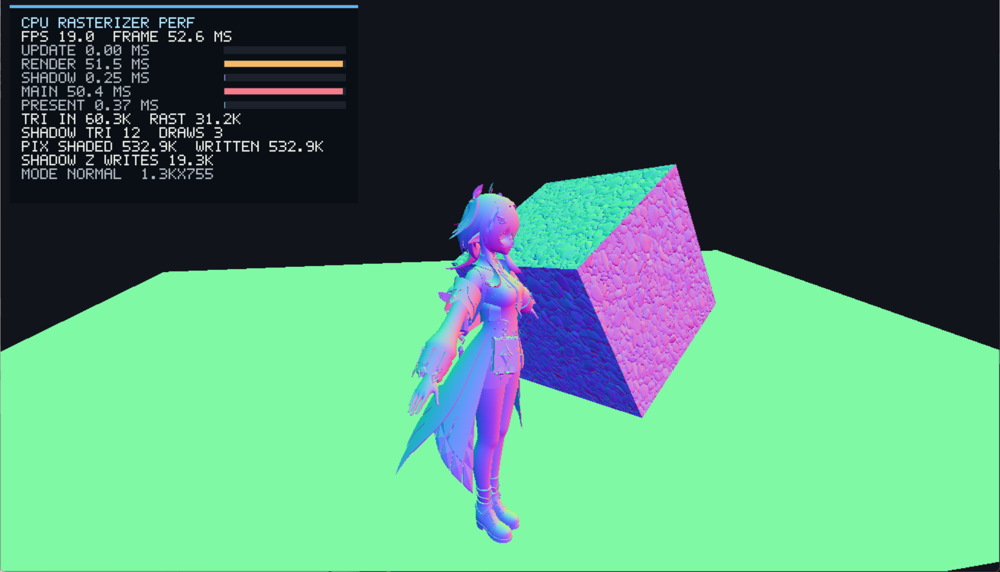
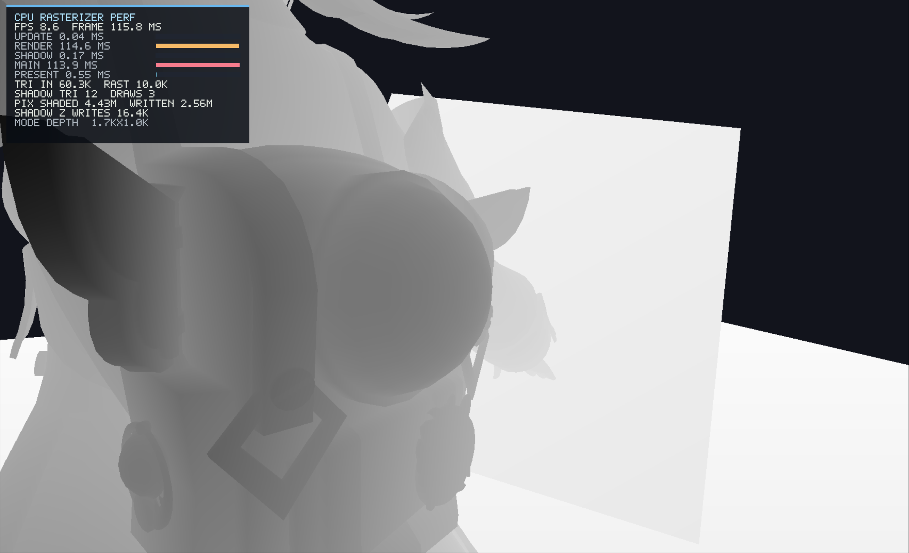
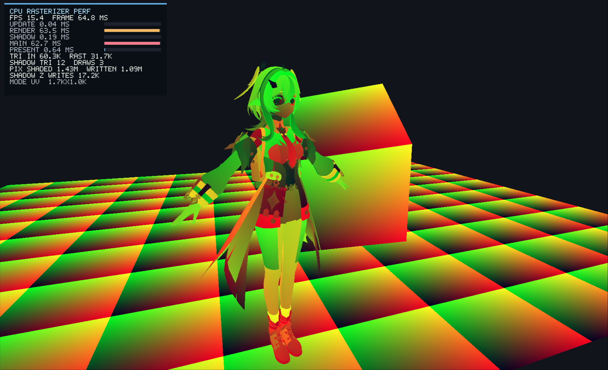
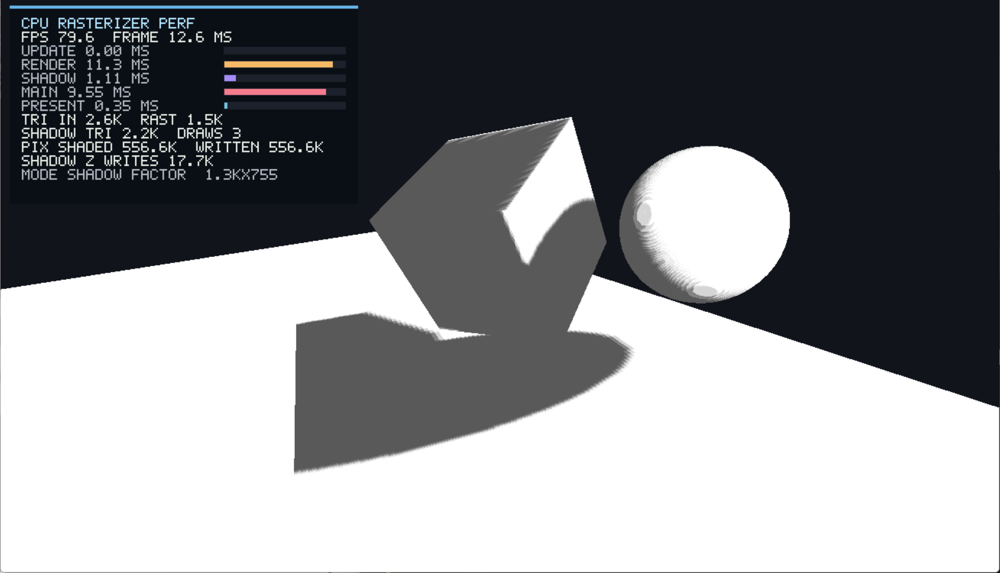
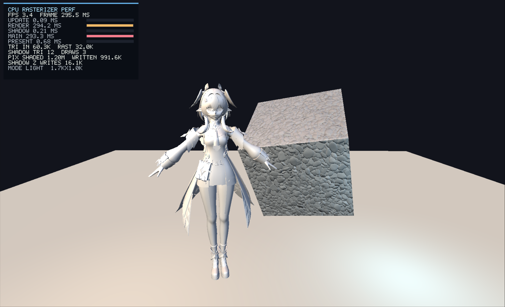
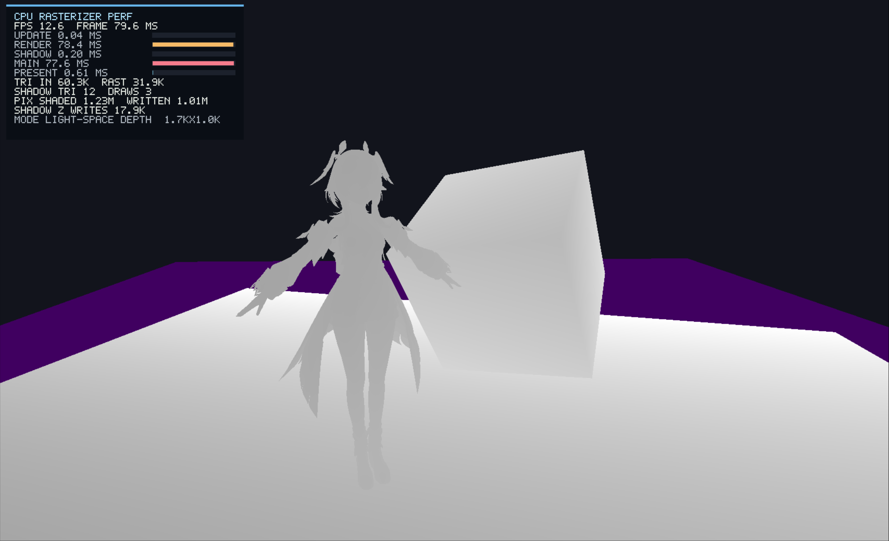
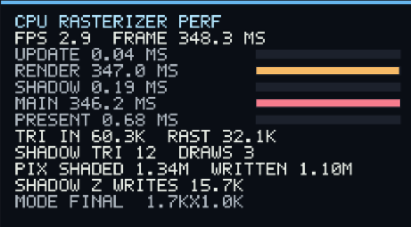

# CPU Rasterizer

一个使用 C++20 和 Win32 API 编写的纯 CPU 软件光栅化渲染器。项目不依赖 Direct3D、OpenGL 或 Vulkan，而是在 CPU 侧实现从场景数据到窗口显示的核心渲染流程：顶点变换、视锥裁剪、三角形光栅化、深度测试、透视校正插值、纹理采样、法线贴图、线性空间多光源 Blinn-Phong 着色、Reinhard tone mapping、阴影贴图和调试视图。

当前 CMake 配置包含 `CPURasterizerCore` 静态库、`CPURasterizer` Windows GUI 程序和 `CPURasterizerTests` 测试目标；默认窗口大小为 960x540，画面通过 Win32 `StretchDIBits` 提交到窗口。

## 功能概览

- 纯 CPU 渲染管线：不调用图形 API，顶点处理、裁剪、光栅化、深度和像素着色都在 CPU 完成。
- 视锥裁剪与三角形重建：在裁剪空间处理 6 个平面，并将裁剪后的多边形重新三角化。
- 透视校正插值：对 UV、法线、切线、世界坐标、视图坐标等属性执行基于 `1/w` 的插值。
- 材质与纹理：支持 diffuse texture、normal map、环境光、漫反射、高光和 shininess 参数。
- OBJ 加载：支持 Wavefront OBJ 的位置、UV、法线、负索引和多边形三角化，并可将模型归一化到场景尺寸。
- CPU Shadow Mapping：从主方向光视角生成 512x512 深度图，shadow map 会先投影有效三角形，再按 tile 并行光栅化；主渲染阶段使用 bias 和 3x3 PCF 计算阴影因子。
- 多光源着色：渲染器最多支持 3 个方向光和 2 个点光源；当前展厅启用 1 个方向光和 1 个暖色点光源，Final / Light 模式在 float linear RGB 中执行 Blinn-Phong 光照。
- Tone Mapping：Final / Light 模式输出支持 exposure、固定 Reinhard tone mapping 和 gamma encode；Albedo / Normal / Depth / UV / Shadow / LightDepth 调试视图不做 tone mapping。
- Tile-based 多线程主渲染：主 pass 与 shadow pass 都使用持久线程池和原子计数器动态领取 32x32 tile。
- 性能 HUD：展示 FPS、帧耗时、Update/Render/HUD/Present、Shadow/Main Pass 耗时和渲染统计。
- 调试视图：可在最终画面、Albedo、Normal、Depth、UV、Shadow Factor、Light 和 Light-space Depth 之间切换。

## 预览

### 最终渲染



### 调试视图

| Albedo | Normal |
| --- | --- |
|  |  |
| Depth | UV |
|  |  |
| Shadow Factor | Light |
|  |  |
| Light-space Depth |  |
|  |  |

### 性能 HUD



## 构建要求

- Windows
- CMake 3.20 或更新版本
- 支持 C++20 的 C++ 编译器，推荐 Visual Studio / MSVC
- Windows SDK，需包含 Win32、COM 和 Windows Imaging Component

项目目前是 Windows 桌面程序。`Texture::loadFromFile` 依赖 Windows Imaging Component，CMake 也会链接 `ole32` 和 `windowscodecs`。

## 构建与运行

在仓库根目录执行：

```powershell
cmake -S . -B build
cmake --build build --config Release
.\build\Release\CPURasterizer.exe
```

运行测试：

```powershell
ctest --test-dir build -C Release --output-on-failure
```

Debug 构建也可以运行：

```powershell
cmake --build build --config Debug
.\build\Debug\CPURasterizer.exe
```

复杂 OBJ、阴影贴图、PCF 采样和主渲染都在 CPU 上执行，查看完整场景时建议优先使用 Release 构建。

## 操作说明

| 输入 | 功能 |
| --- | --- |
| `W` / `S` | 前进 / 后退 |
| `A` / `D` | 左移 / 右移 |
| `E` 或 `Space` | 上移 |
| `Q` 或 `Ctrl` | 下移 |
| `Shift` | 加速移动 |
| 方向键 | 旋转视角 |
| 鼠标右键拖动 | 旋转视角 |
| `1` 到 `8` | 切换渲染模式 / 调试视图 |
| `F2` | 显示或隐藏性能 HUD |
| `F3` | 暂停或继续中央展品旋转 |
| `F11` 或 `Alt+Enter` | 切换全屏 |

渲染模式对应关系：

| 按键 | 模式 | 说明 |
| --- | --- | --- |
| `1` | Final | 最终材质、纹理、光照、阴影和 tone mapping 结果 |
| `2` | Albedo | diffuse 纹理、顶点颜色和材质颜色 |
| `3` | Normal | 视图空间法线，包含 normal map 影响 |
| `4` | Depth | 当前相机视角的 NDC 深度 |
| `5` | UV | 纹理坐标可视化 |
| `6` | Shadow Factor | bias 和 PCF 后的阴影因子 |
| `7` | Light | 白色表面上的光照响应，应用同 Final 一致的 display transform |
| `8` | Light-space Depth | 像素投影到主方向光空间后的深度 |

## 场景与资源

默认场景是一间现代室内模型展厅，由 8 个 draw command 组成：地面、后墙、左右侧墙、中央展台与展品、长凳和高立方柱。地面同时使用漫反射贴图与法线贴图，中央展品、展台和几何体会在墙面与地面上形成清晰阴影；不同物体使用金属、石材、墙面和强调色等不同材质。

运行时会在当前目录及上级构建目录附近查找资源：

- `res/Texture/Frosted Metal Texture.jpeg`
- `res/Texture/Cobblestone_pavement_texture.jpeg`
- `res/Texture/Cobblestone_pavement_normal_texture.png`
- `res/Model/Showcase.obj`（可选的中央展示模型）

如果纹理加载失败，程序会回退到内置棋盘格纹理。中央模型只会查找文件名精确匹配的 `Showcase.obj`；未提供该文件时，场景使用内置低多边形雕塑占位，不会自动加载目录中的其他 OBJ。OBJ 搜索目录包括 `res/Model` 和 `res/Models` 及其若干上级相对路径。

## 目录结构

源码相关目录结构如下，省略 `build/` 等本地生成目录：

```text
.
|-- .gitignore              # 忽略本地构建和 IDE 产物
|-- CMakeLists.txt          # CMake 工程入口，定义核心库、程序和测试目标
|-- README.md               # 项目说明
|-- docs/
|   |-- images/             # README 截图
|   `-- performance.md      # 分块多线程渲染性能分析
|-- res/
|   |-- Model/             # 可放置可选的 Showcase.obj
|   `-- Texture/
|       |-- Frosted Metal Texture.jpeg                  # 金属材质默认贴图
|       |-- Cobblestone_pavement_texture.jpeg          # 地面漫反射贴图
|       |-- Cobblestone_pavement_normal_texture.png    # 地面法线贴图
|       `-- Brushed metal texture.jpeg                 # 额外金属纹理资源
|-- src/
|   |-- main.cpp            # Windows 入口
|   |-- core/               # Application、Camera、Framebuffer、Performance HUD
|   |-- math/               # 向量、矩阵和基础数学函数
|   |-- platform/           # Win32 窗口、输入和 framebuffer 提交
|   |-- renderer/
|   |   |-- Renderer.*              # 顶层渲染调度、模式切换和 pass 编排
|   |   |-- TriangleRasterizer.*    # 裁剪、屏幕变换、三角形设置、深度和片元插值
|   |   |-- ShadowMapper.*          # shadow map 生成、light-space 投影、tile 并行光栅化和 PCF 阴影因子
|   |   |-- Shading.*               # 纹理/法线贴图、调试颜色、线性空间 Blinn-Phong 着色与 tone mapping
|   |   |-- TileScheduler.*         # 32x32 tile 生成与持久线程池动态调度
|   |   |-- RenderStats.*           # 渲染统计结构和耗时换算
|   |   |-- RasterHelpers.h         # edge function、重心权重和小型栅格化工具
|   |   `-- pass、材质、纹理、OBJ 加载和顶点结构
|   `-- scenes/             # 资源定位、场景预设、网格生成和 draw command 组织
`-- tests/
    |-- TestMain.cpp        # 测试入口
    |-- AssetLocatorTests.cpp
    |-- MeshFactoryTests.cpp
    |-- ObjLoaderTests.cpp
    |-- RendererTests.cpp
    |-- TestSceneTests.cpp
    `-- ThreadPoolTests.cpp
```

## 渲染流程

```mermaid
flowchart LR
    A["TestScene draw commands"] --> B["Light-space shadow map pass"]
    A --> C["Model/View/Projection transform"]
    C --> D["Frustum clipping"]
    D --> E["Perspective divide and viewport mapping"]
    E --> F["Triangle setup and 32x32 tile coverage"]
    F --> G["Persistent thread pool with atomic tile scheduling"]
    G --> H["Camera-depth prepass into framebuffer"]
    H --> I["Color/debug pass with depth test"]
    I --> J["Perspective-correct interpolation"]
    J --> K["Texture and normal map sampling"]
    K --> L["Lighting and shadow-map lookup"]
    L --> M["Framebuffer write"]
    M --> N["Win32 StretchDIBits present"]
```



## 注意事项

- CMake 已启用 CTest；`CPURasterizerTests` 覆盖资源定位、网格生成、OBJ 加载、渲染器基础行为和默认场景。
- 仓库里的 `build/` 是本地生成目录，不是源码的一部分；重新配置时以根目录的 `CMakeLists.txt` 为准。
- 资源路径以运行目录相对查找为主，从仓库根目录或常见 CMake 输出目录启动程序都能找到默认资源。
- 项目定位是学习和展示 CPU 光栅化管线，不包含 GPU 后端或完整引擎封装。
